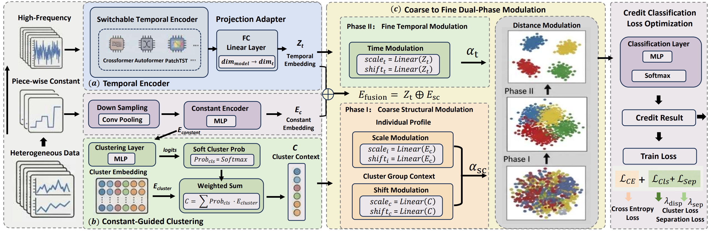

# CGDPM

## Introduction

Enterprise credit rating often relies on heterogeneous data sources with inconsistent update frequencies, leading to heterogeneous temporal granularity across variables. Existing methods do not fully model these dynamics or clearly leverage the different roles of low- and high-frequency signals.


CGDPM (Constant-Guided Heterogeneous Aware Dual-Phase Modulation) addresses this by combining: (a) switchable temporal encoders for high-frequency dynamics, (b) constant-guided clustering for low-frequency piece-wise constant information, and (c) dual-phase feature-wise modulation for coarse-to-fine fusion. Experiments on a real-world heterogeneous enterprise dataset show strong performance and practical compatibility across multiple temporal backbones.



This repository provides the PyTorch implementation of CGDPM, with a unified training pipeline and support for Transformer, Autoformer, TimesNet, PatchTST, Crossformer, FEDformer, Informer, DLinear, TimeFilter, and TimeMixer.

## Requirements

### Environment

- Python 3.9+
- CUDA-enabled GPU is recommended (CPU is also supported)

### Installation

```bash
# Optional: create and activate a clean environment
conda create -n cgdpm python=3.10 -y
conda activate cgdpm

# Install dependencies
pip install -r requirements.txt
```

Main dependencies are listed in `requirements.txt`, including `torch`, `sktime`, `scikit-learn`, `numpy`, and `pandas`.

### Reproducibility

You can control data split and randomness via:

- `--seed` (default: 42)
- `--random_split` (default: True)
- `--test_size` (default: 0.3)

## Dataset

Due to industrial privacy and compliance constraints, only a partially anonymized subset of the original dataset is publicly released. Compared with the full industrial deployment setting, the public subset contains reduced feature diversity and weaker heterogeneous temporal characteristics, which may lead to slightly lower absolute performance. Nevertheless, the released subset preserves the core heterogeneous temporal properties of the original task and reproduces the overall performance trends reported in the paper.

- Public sample file: `data/sample_data.ts`
- Data format: UEA-style `.ts`
- In this project, each sample is parsed as:
  - temporal sequence information and piece-wise constant information,
  - piece-wise constant information is reduced to 1D static features by convolution-based downsampling.

If you use your private/full dataset, please keep the same format contract or adapt the loader in `data_provider/data_loader.py`.

## Quick Demo

A quick demo can be run directly on the released sample data.

```bash
python main.py \
  --model_id CGDPM_Crossformer \
  --time_model Crossformer \
  --data UEA \
  --data_path ./data \
  --uea_file sample_data.ts \
  --num_epochs 50 \
  --batch_size 32 \
  --lr 0.001 \
  --num_clusters 8 \
  --num_classes 4 \
  --static_dim 36 \
  --static_emb_dim 32 \
  --cluster_emb_dim 16 \
  --ts_hidden_dim 64 \
  --coarse_rank 8 \
  --label_len 48 \
  --norm True \
  --cluster_dispersion_weight 0.01 \
  --latent_sep_weight 0.01 \
  --output_dir ./outputs \
  --des quick_demo
```

For a full set of per-encoder commands, see:

- `scripts/main.sh`

To run all listed commands in sequence:

```bash
bash scripts/main.sh
```

## Deployment

### 1. Prepare data

- Place your dataset under a local folder (for example `./data`).
- For UEA-like data, set:
  - `--data UEA`
  - `--data_path <your_data_root>`
  - `--uea_file <your_file.ts>`

### 2. Configure experiment

Key options:

- model and backbone: `--model_id`, `--time_model`
- optimization: `--num_epochs`, `--batch_size`, `--lr`
- architecture: `--num_clusters`, `--static_dim`, `--static_emb_dim`, `--cluster_emb_dim`, `--ts_hidden_dim`, `--coarse_rank`
- regularization terms: `--cluster_dispersion_weight`, `--latent_sep_weight`
- outputs: `--output_dir`, `--des`

### 3. Run training

Use one command from `scripts/main.sh` or execute your own command from terminal.

### 4. Check outputs

The training script automatically creates an experiment directory under `--output_dir`, including:

- best model checkpoint (`best_model.pt`)
- confusion matrix figure (`confusion_matrix_best.png`)
- metrics summary file (`best_metrics.txt`)

The current evaluation summary includes:

- Accuracy
- F1-Macro
- F1-Weighted
- AUC
- EDA-Acc

## Acknowledgement

Our implementation adapts Time-Series-Library as the code base and has modified it to our purposes.

This project builds on implementations from the Time-Series-Library (TSLib):

- https://github.com/thuml/Time-Series-Library

We thank the authors and contributors for open-sourcing this valuable benchmark and model ecosystem.
